# Trading Research Toolkit

`Trading` is a .NET 8 / WPF portfolio project for market research, strategy backtesting, trading-robot prototyping, futures arbitrage analysis, AI-assisted news analysis, and secure local credential management.

## Quick Recruiter Summary

This project demonstrates end-to-end algorithmic trading research: hypothesis generation, historical data processing, backtesting, walk-forward validation, real trading robots connected to brokerage accounts, and post-trade analysis. It includes strategy research tools for EMA/RSI/MA models, grid trading, stock/futures arbitrage, orderbook-density analysis, AI-assisted news triage, and secure credential management.

The project contains configurable robot hosts that can run selected strategy implementations on real accounts through application settings: account, instruments, risk parameters, and execution mode are selected before launch. The key result is not a polished claim of a profitable strategy, but a disciplined research workflow: the project tests ideas, validates them against later data and real-account robot behavior, identifies overfitting, and documents why several attractive-looking strategies fail once liquidity, execution, commissions, and regime changes are considered.

Core competencies demonstrated: C#/.NET 8, WPF desktop engineering, multi-project architecture, market-data handling, T-Invest API integration, backtesting engines, trading-robot prototyping, quantitative validation, ScottPlot visualization, AI/LLM integration, and secure secret management.

The repository is organized as a single Visual Studio solution with several focused desktop applications and one shared library. It was built as a research and engineering workspace rather than a packaged trading product: the emphasis is on data handling, backtesting workflows, visual analysis, API integration, and practical tooling around trading experiments.

> This repository is for software engineering and research demonstration purposes only. It is not financial advice and is not intended for unattended production trading without additional risk controls, monitoring, audit logging, and operational safeguards.

## What This Project Demonstrates

- C# / .NET 8 desktop development with WPF.
- Multi-project solution architecture.
- Shared domain and infrastructure code through `CommonClasses`.
- Integration with T-Invest API for instruments, candles, market data, and trading-related workflows.
- Historical candle loading, local data processing, and strategy backtesting.
- ScottPlot-based visualization of price series, equity curves, optimization windows, validation periods, and strategy results.
- Futures arbitrage research workflow: data collection, offline analysis, and robot mode.
- AI-assisted news analysis with ChatGPT and DeepSeek integration points.
- Secure local secret lookup through Windows Credential Manager.
- Git-ready project hygiene with generated build artifacts excluded from source control.

## Solution Structure

| Project | Type | Purpose |
| --- | --- | --- |
| `CommonClasses` | Class library | Shared infrastructure: T-Invest helpers, historical data models, robot base classes, strategy utilities, credential management, and optimization helpers. |
| `StrategyBacktester` | WPF app | Interactive strategy research and backtesting UI. Includes grid strategy, EMA crossover, pair/futures correlation research, orderbook-density visualizations, and parameter search experiments. |
| `BondSelectorWPF` | WPF app | Conservative OFZ-IN bond selector focused on inflation-linked Russian government bonds, liquidity filters, YTM, duration, turnover, and carry/roll-down style analysis. |
| `RoboTrader` | WPF app | Trading-robot host and monitoring UI for robot settings, portfolio/deposit history, and strategy execution experiments. |
| `RoboFutureArbitr` | WPF app | Futures arbitrage workspace with three launch modes: data collection, collected-data analysis, and trading robot mode. |
| `RoboAINewsReader` | WPF app | News and candle forecasting workspace with ChatGPT/DeepSeek-based news analysis and candle forecast tooling. |
| `CredentialsEditor` | WPF app | Windows Credential Manager editor for listing, adding, editing, and deleting local credentials used by the other projects. |

## StrategyBacktester Highlights

`StrategyBacktester` is the main research UI. It contains several independent windows for testing and visualizing trading ideas:

- `GridStrategy`: grid-style backtest on a selected ticker and date range.
- `EmaCrossoverBacktest`: EMA crossover strategy with ticker selection, date range, optimization interval, delay interval, and validation interval.
- `PairsCorrelation`: stock/futures relationship research with selectable instruments and test period.
- `OrderbookDensity`: price-density map based on candle ranges, volume weighting, deviation, and decay.
- `OrderbookTimeDensity`: time-density map showing where price spent more time, with configurable decay.
- `GrokAdvice`: RSI mean-reversion parameter search.
- `GrokAdvice1`: moving-average / ATR crossover parameter search.

Several backtest windows use a walk-forward style layout: the full selected price period is shown on the upper chart, while the equity curve and test result are shown from the beginning of the optimization period through the end of the validation period. Optimization and validation intervals are highlighted visually to make the split between fitting and checking explicit.

## AI News Analysis

`RoboAINewsReader` can run market-news analysis through ChatGPT, DeepSeek, or both providers, using a configurable number of recent news items and optional candle context. The tool maps news to potentially affected instruments, estimates direction, volatility impact, timeframe, confidence, risk level, and suggested action.

Initial experiments show that the output can look useful at first glance, but it is not consistent enough to be used as an autonomous trading signal. ChatGPT and DeepSeek may select different instruments, skip the same news item, assign different confidence levels, or explain the same event through different market assumptions. Because of this, the module should be treated as a first-pass filter and alerting tool: it helps highlight news that may deserve human attention, but every result requires manual review before it can influence a trading decision.

The practical conclusion is cautious: AI news analysis is valuable for triage, summarization, and surfacing potentially market-moving events, but it is not a replacement for analyst validation, liquidity checks, risk assessment, and independent confirmation.

`CandleForecasterWindow` explores a second AI use case: forecasting future price movement from candle history. This experiment showed little practical value. When the model receives only historical candle data, it tends to extend the existing trend almost linearly into the future. That is usually the most obvious and internally consistent assumption available from the chart alone, but it does not create a useful trading edge and does not reliably anticipate reversals, regime changes, or liquidity-driven moves.

## Trading Robots

The solution also includes trading robots that implement selected research hypotheses on real brokerage accounts. Robot behavior is configured through application settings: the user selects the strategy configuration, account, instruments, risk parameters, and execution mode before launch.

Live account behavior matched the corresponding backtesting results closely enough to validate the backtest mechanics. This is an important research result by itself: it suggests that the simulation logic, commission handling, position accounting, and execution assumptions are close enough for the tested scenarios. It also strengthens the conclusions about overfitting: when optimized models failed in backtests and showed similar behavior in real-account experiments, the issue was not only a visualization artifact, but a real lack of strategy robustness.

## Backtest Result Gallery

The screenshots below show `EmaCrossoverBacktest`, a deliberately compact research window for testing a parameterized EMA crossover strategy. The tool loads a full candle interval, searches parameters on an optimization window, then evaluates the selected parameter set on a later validation window.

The upper chart shows the full loaded price history. The middle chart shows the equity curve only for the walk-forward segment: the green band is the optimization interval and the red band is the validation interval. The lower chart shows position state and the flat-market filter. This layout is useful because it makes the difference between "fit on history" and "checked later" visible.

For the EMA Crossover, Grok RSI, and Grok MA examples below, the backtests assume trading with the maximum broker-permitted leverage that does not require uncovered positions. Broker commissions are included in the calculations, so the shown equity curves and profitability figures are net of the modeled commission cost.

#### EMA Crossover - SBER, delayed validation window

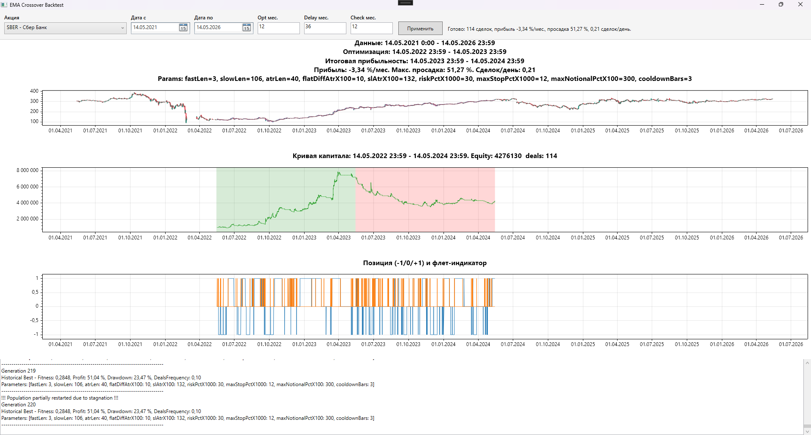

This run uses SBER hourly candles for 14.05.2021 - 14.05.2026. The optimizer searches parameters on 14.05.2022 - 14.05.2023 and validates them on 14.05.2023 - 14.05.2024 after a 36-month delay from the end of the loaded data. The selected parameter set produces a strong equity rise during the green optimization window, then a visible deterioration during the red validation window. The final validation result is negative: about `-3.34%/month` with a drawdown above `51%`.

Backtesting interpretation: this is a classic overfitting warning. The historical optimizer found a parameter combination that described one favorable regime well, but the same parameters did not remain robust when tested later. The equity curve changes character at the boundary between the fitted and validation periods, which suggests the model learned a local historical pattern rather than a stable market rule.

#### EMA Crossover - SBER, recent validation window

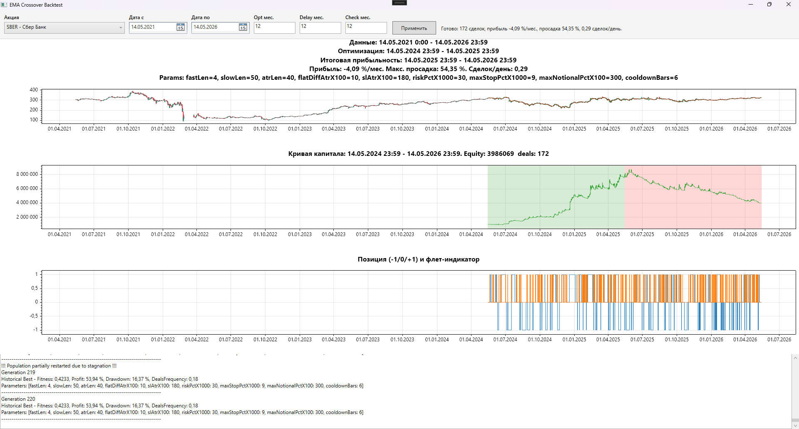

This run keeps the same SBER data range but moves the walk-forward window closer to the end of the dataset: optimization on 14.05.2024 - 14.05.2025 and validation on 14.05.2025 - 14.05.2026. The optimizer again finds an attractive historical segment with high in-sample growth. The red validation area then trends downward, ending with about `-4.09%/month`, a drawdown above `54%`, and 172 trades.

Backtesting interpretation: changing only the optimization placement changes the selected parameters and still fails out-of-sample. This reinforces the central lesson: a flexible EMA/ATR/flat-filter model has enough degrees of freedom to fit noise, regime-specific movement, and local volatility structure. A high in-sample fitness score does not imply a reliable predictive model.

#### EMA Crossover - GAZP, cross-instrument check

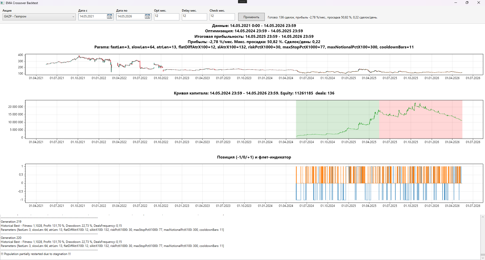

This run applies the same workflow to GAZP over 14.05.2021 - 14.05.2026, with optimization on 14.05.2024 - 14.05.2025 and validation on 14.05.2025 - 14.05.2026. The optimization window again creates a strong equity curve. The validation window is weaker and eventually negative, with about `-2.78%/month` and a drawdown above `50%`.

Backtesting interpretation: testing on another instrument helps distinguish a strategy idea from an instrument-specific fit. The result shows similar behavior: a parameter set can look convincing during optimization but fail to generalize to the next market regime. This does not prove that EMA crossover logic is useless, but it does show that this implementation cannot be treated as a reliably trainable historical model without stronger validation.

#### Backtesting Lessons From These Runs

- The strategy is highly sensitive to the chosen optimization window.
- The optimizer can find parameter sets with impressive in-sample equity curves, but those parameters degrade in later validation periods.
- The validation results show large drawdowns and negative monthly returns despite good historical fitness.
- The number of parameters (`fastLen`, `slowLen`, `atrLen`, flat filter, stop size, risk, notional cap, cooldown) creates enough flexibility to overfit local market regimes.
- A single historical split is not enough. Robustness would require multiple rolling walk-forward tests, cross-instrument checks, transaction-cost modeling, slippage assumptions, liquidity checks, and parameter-stability analysis.
- The screenshots intentionally document a negative research result: the model is useful as a backtesting experiment, but it cannot be considered reliably trained on historical data.

The practical conclusion is conservative: `EmaCrossoverBacktest` is valuable as a research and visualization tool, not as evidence of a production-ready trading strategy. The screenshots demonstrate why visual separation of optimization and validation windows matters in backtesting.

#### Grok RSI - GAZP, 6M optimization / 6M validation

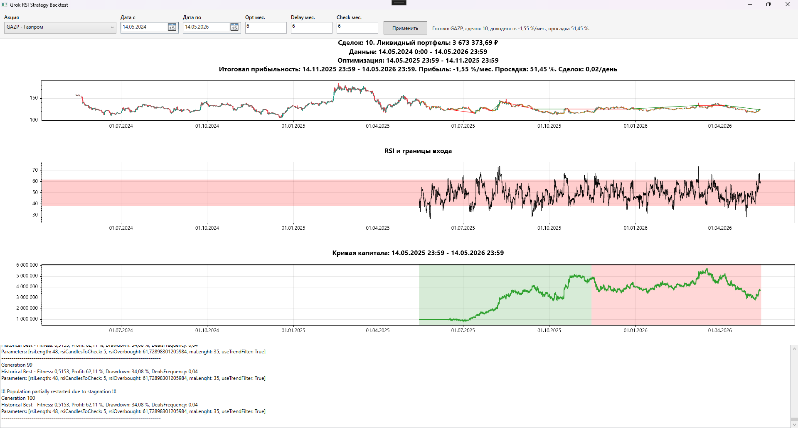

This run tests the RSI-based `GrokAdvice` workflow on GAZP for 14.05.2024 - 14.05.2026. The optimizer uses 14.05.2025 - 14.11.2025 and validates the selected parameters on 14.11.2025 - 14.05.2026. The historical best in the optimization log is positive, but the validation result ends at about `-1.55%/month` with a drawdown above `51%` and only 10 trades.

Backtesting interpretation: the low trade count makes the result statistically weak. Even if the optimization segment looks usable, the later period does not confirm a stable edge. This is a warning that the strategy can fit a narrow slice of history without learning a repeatable RSI pattern.

#### Grok RSI - GAZP, 12M optimization / 12M validation

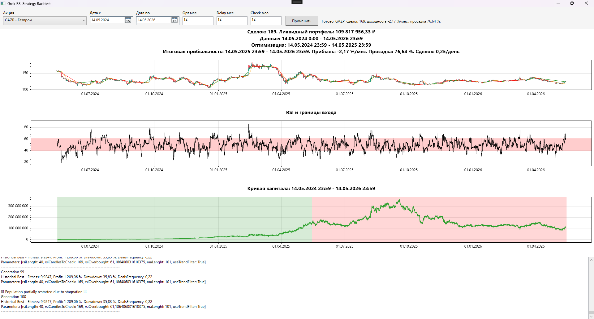

This run uses a longer walk-forward split: optimization on 14.05.2024 - 14.05.2025 and validation on 14.05.2025 - 14.05.2026. The optimizer finds an extremely strong historical best in the fitted interval, but the validation window finishes at about `-2.17%/month` with a drawdown above `76%` across 169 trades.

Backtesting interpretation: this is the clearest overfitting example in the Grok RSI set. A very high in-sample result does not survive the out-of-sample window. The model has enough freedom in RSI length, overbought threshold, lookback confirmation, moving-average filter, and trend filter to describe the past very well while failing on the next regime.

#### Grok RSI - SBER, 6M optimization / 6M validation

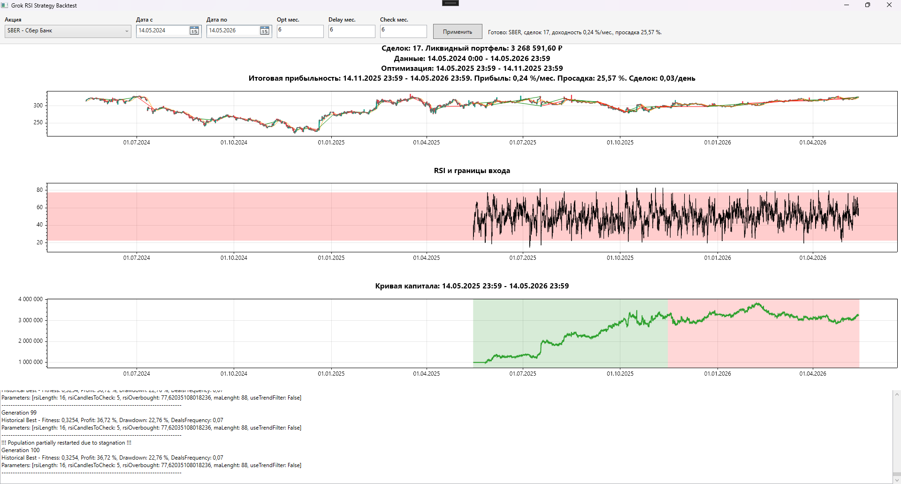

This run applies the same RSI workflow to SBER for 14.05.2024 - 14.05.2026, with optimization on 14.05.2025 - 14.11.2025 and validation on 14.11.2025 - 14.05.2026. The validation result is slightly positive at about `0.24%/month`, with a drawdown above `25%` and 17 trades.

Backtesting interpretation: this is not enough evidence for a reliable strategy. The result is marginal, the number of trades is small, and the drawdown is large relative to the observed profitability. It is better read as a fragile research outcome than as confirmation that RSI parameters can be trained reliably on this history.

#### Grok RSI - SBER, 12M optimization / 12M validation


This run uses SBER with a 12-month optimization interval followed by a 12-month validation interval. The optimizer again finds a strong fitted result, but the validation period ends at about `-1.24%/month` with a drawdown above `56%` across 73 trades.

Backtesting interpretation: the cross-instrument result repeats the same pattern seen on GAZP. Parameters that look convincing during historical selection do not remain stable in the later period. The equity curve also shows that a strategy may accumulate a large in-sample profit and still give back a significant part of it once the regime changes.

#### Grok RSI Research Takeaways

- RSI threshold strategies are especially prone to overfitting because small parameter changes can select very different local price regimes.
- The optimizer can produce impressive historical best values, but those values are not reliable evidence of future profitability.
- Out-of-sample validation is weak or negative in most shown runs, with drawdowns from roughly `25%` to more than `76%`.
- The 6-month SBER case is slightly positive, but the low number of trades makes it too fragile to treat as a robust model.
- The same idea behaves differently across GAZP and SBER, which suggests regime and instrument dependence rather than a universal edge.
- The practical conclusion is cautious: `GrokAdvice` is useful for studying RSI parameter sensitivity and failure modes, but these examples do not support the idea that the strategy can be reliably trained on historical data alone.

#### Grok MA - GAZP, 12M optimization / 12M validation

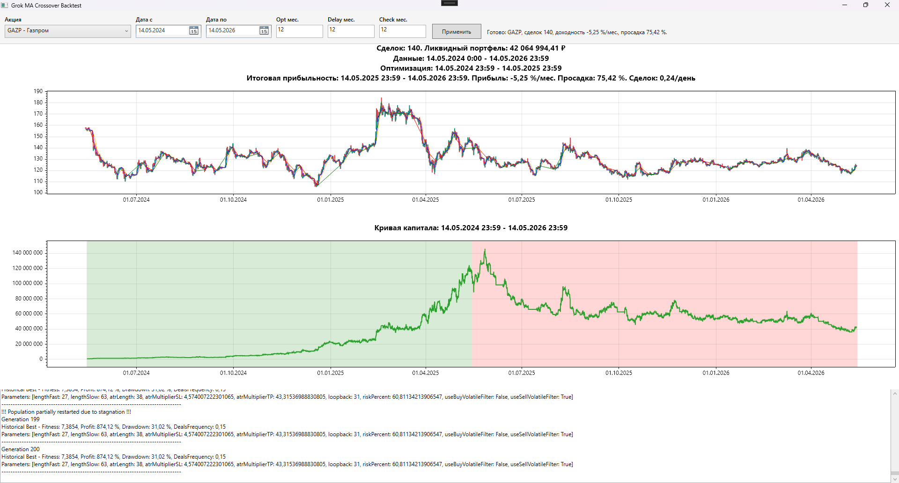

This run tests the moving-average / ATR-based `GrokAdvice1` workflow on GAZP for 14.05.2024 - 14.05.2026. The optimizer uses 14.05.2024 - 14.05.2025 and validates the selected parameters on 14.05.2025 - 14.05.2026. The fitted interval reaches a very strong historical best, but the validation result is about `-5.25%/month` with a drawdown above `75%` across 140 trades.

Backtesting interpretation: this is a severe out-of-sample failure. The model captures a favorable historical price structure during optimization, then loses stability in the validation year. The size of the drawdown is especially important because the test already includes broker commissions and uses only leverage that remains within the broker-permitted covered-position limit.

#### Grok MA - SBER, 12M optimization / 12M validation

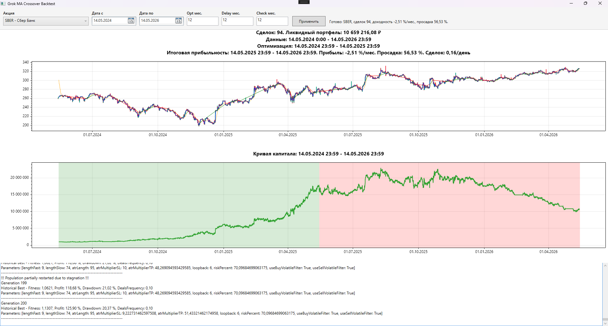

This run applies the same Grok MA workflow to SBER for 14.05.2024 - 14.05.2026. The validation period ends at about `-2.51%/month`, with a drawdown above `56%` and 94 trades. The equity curve shows that the strategy can continue rising shortly after the optimization boundary, but then fails to preserve the fitted profitability.

Backtesting interpretation: the result is weaker than the in-sample optimizer output and does not support a stable edge. The moving-average and ATR parameters appear sensitive to the chosen market regime, which means the optimizer can select a setup that works for one year but degrades in the next.

#### Grok MA - MGNT, 12M optimization / 12M validation

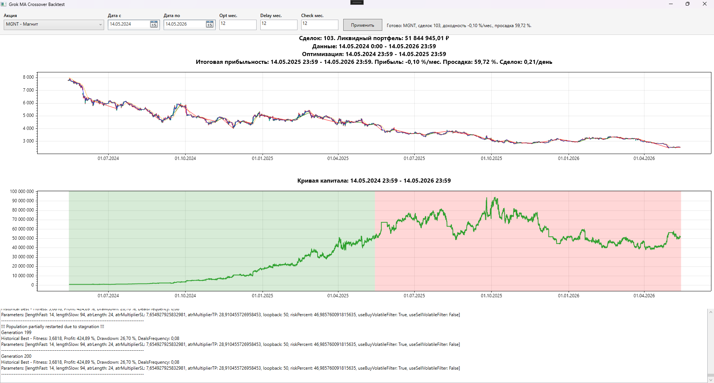

This run checks MGNT over the same 14.05.2024 - 14.05.2026 period. The optimizer finds a strong historical best during the fitted year, but the validation period is almost flat to negative: about `-0.10%/month`, with a drawdown above `59%` and 103 trades.

Backtesting interpretation: this is a useful cross-instrument control case. Even where the final monthly result is close to zero rather than deeply negative, the drawdown is too large for the return profile. The strategy does not show enough out-of-sample robustness to justify trusting the optimized parameters as a trained model.

#### Grok MA Research Takeaways

- Grok MA is strongly regime-dependent: the optimizer can exploit a trending or volatile historical section, but the fitted parameters do not generalize reliably.
- Large in-sample historical best values are followed by weak or negative validation results on GAZP, SBER, and MGNT.
- Drawdowns remain high even though broker commissions are included and the leverage assumption stays inside the broker-permitted covered-position boundary.
- Cross-instrument testing weakens the investment case: the same optimization workflow does not produce stable validation behavior across different stocks.
- The practical conclusion is conservative: `GrokAdvice1` is useful for studying moving-average / ATR parameter sensitivity, but these screenshots document overfitting risk rather than a production-ready trading model.

#### Grid Strategy - SBERP

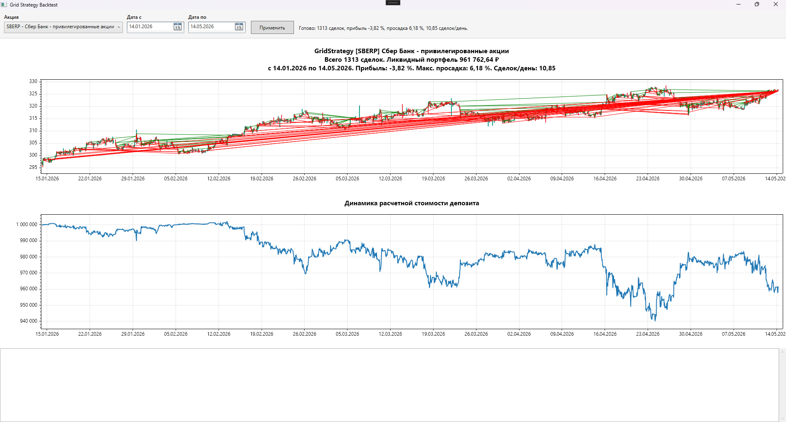

This run shows `GridStrategy` on SBERP for 14.01.2026 - 14.05.2026. The strategy performs many small grid trades, closing profitable oscillations while carrying the risk of positions that remain open when price movement does not revert as expected. The result is negative: about `-3.82%`, with a drawdown above `6%` and 1,313 closed trades.

Backtesting interpretation: the large number of closed trades can create an illusion of stable activity, but the equity curve shows that profitable exits do not solve the core risk. In many grid systems, the open losing tail absorbs the profit from positions that closed in the money. The strategy earns small realized gains while accumulating exposure to moves that do not mean-revert quickly enough.

#### Grid Strategy - GAZP

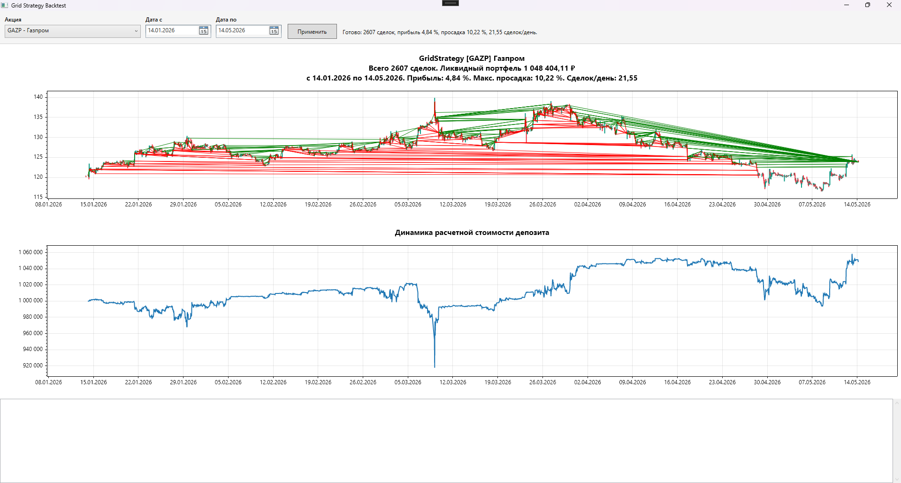

This run applies the same grid workflow to GAZP for 14.01.2026 - 14.05.2026. The result is positive on the selected period: about `4.84%`, with a drawdown above `10%` and 2,607 closed trades. The chart shows many profitable closures, but also long stretches where open exposure dominates the account dynamics.

Backtesting interpretation: the positive result does not remove the structural problem. A grid can look attractive while the market oscillates inside a favorable range, but the risk is shifted into open positions. Once price trends against the accumulated side, the account needs either very conservative position sizing or a very large margin reserve.

#### Grid Strategy Research Takeaways

- Grid trading often monetizes small reversals while hiding the main risk in still-open positions.
- Closed profitable trades can be outweighed by unrealized losses from the positions that did not revert.
- Reducing grid size and position size may produce very low returns relative to the capital reserved for margin.
- Increasing size to make the return meaningful creates a requirement for a practically unbounded margin deposit.
- This creates an unfavorable fork: either very low high-risk profitability, or a margin model that eventually breaks when the market trends far enough.
- The practical conclusion is severe: `GridStrategy` is useful for demonstrating why grid logic is fragile, but these examples do not support treating it as a sustainable standalone strategy.

#### Orderbook Density - SBER

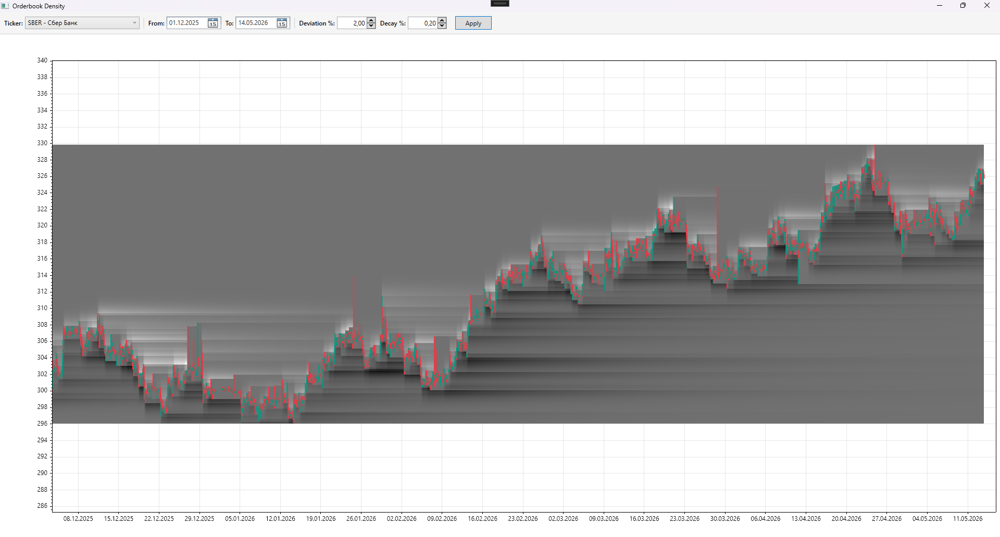

This screenshot shows `OrderbookDensity` for SBER over 01.12.2025 - 14.05.2026. The gray heatmap accumulates price-density zones using candle ranges, volume weighting, deviation, and decay, while candles are drawn on top of the density field.

Backtesting interpretation: the density bands are visually useful, but they do not prove support or resistance. Price sometimes reacts near dense areas, sometimes breaks through them, and sometimes moves through without a meaningful reaction. The same visual structure can support different stories after the fact.

#### Orderbook Density - GAZP

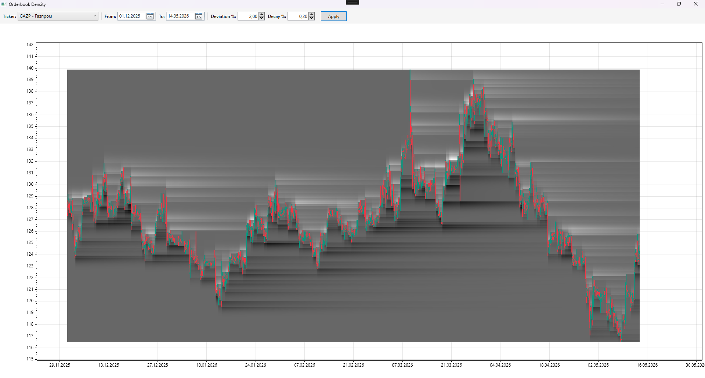

This run applies the same density view to GAZP. The accumulated bands highlight where price spent time or where previous candle ranges left heavier traces. Several areas look like potential reaction zones, but later price action does not treat them consistently.

Backtesting interpretation: density can help describe market memory, but it is not a reliable standalone signal. A bounce from a dense zone and a clean breakdown through the same type of zone are both normal outcomes. The chart is useful for context, not for deterministic level prediction.

#### Orderbook Density - SNGS

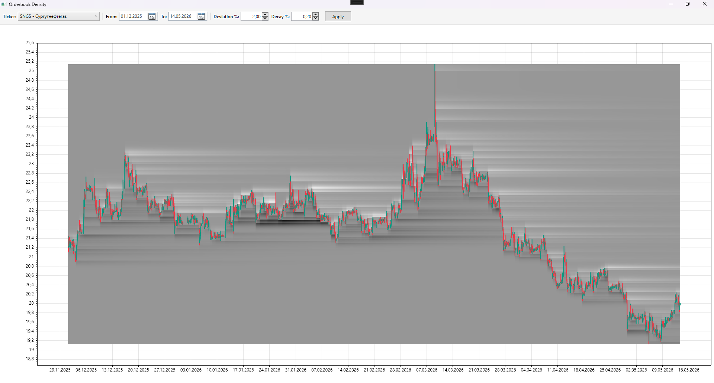

This run checks SNGS over the same period. The chart contains several visible density shelves, but the later downtrend shows that accumulated density does not prevent price from moving through prior active areas when the current order flow changes.

Backtesting interpretation: the example is a good warning against treating historical density as a mechanical support/resistance map. The fact that many candles previously traded around a price does not guarantee future liquidity, future defense of that level, or a predictable reversal.

#### Orderbook Density Research Takeaways

- Accumulated price density is descriptive, not predictive.
- Dense zones cannot be treated as reliable support or resistance levels by themselves.
- Breakout, bounce, and no-reaction scenarios are all plausible around the same type of density band.
- The method is sensitive to decay, deviation width, candle interval, and the selected historical window.
- Historical density may be worth considering as market context, but it should not be used as a standalone entry or exit signal.
- The practical conclusion is modest: `OrderbookDensity` is useful for visual analysis, but the screenshots do not support the idea that density accumulation can reliably forecast future level behavior.

#### Orderbook Time Density - SBER

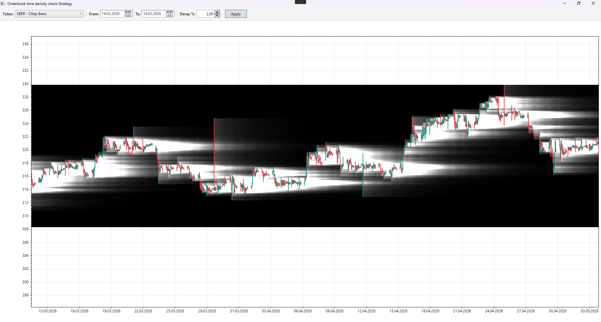

This screenshot shows `OrderbookTimeDensity` for SBER over 14.02.2026 - 14.05.2026. Unlike price-density accumulation, this view emphasizes how long price spent inside each range. Bright zones can be read as areas where the market spent more time and may therefore describe a temporary price corridor.

Backtesting interpretation: time-density can provide a useful market-context hint, especially when price repeatedly rotates inside the same band. However, the chart should not be treated as proof that the corridor will hold. Price can still leave the area abruptly when volatility, liquidity, or order flow changes.

#### Orderbook Time Density - GAZP

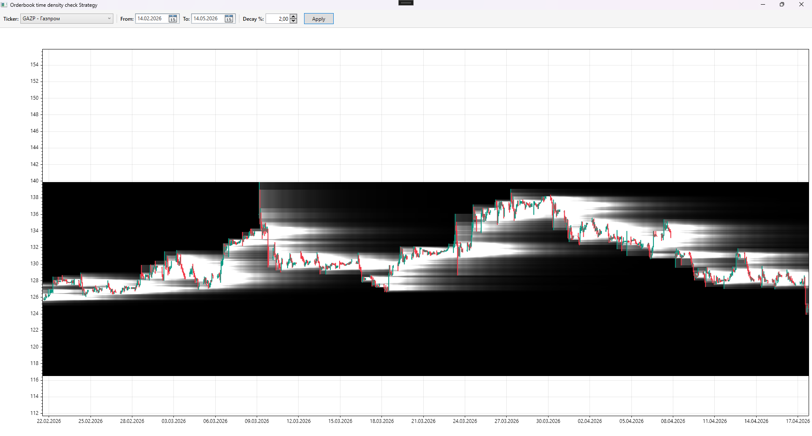

This run applies the same time-density view to GAZP. The bright bands show where price spent more time during the selected interval, and several zones visually resemble intraday or multi-day balance areas.

Backtesting interpretation: the concept is more promising as a corridor-detection hypothesis than as a direct trading rule. The visual pattern may help identify where price previously balanced, but it does not answer whether the next touch should be traded as a bounce, breakout, or ignored.

#### Orderbook Time Density Research Takeaways

- Accumulated time in a price interval may help identify balance zones or price corridors.
- These corridors should be treated cautiously because they can disappear when the market regime changes.
- The method needs further statistical research: corridor persistence, breakout probability, reaction size, false-signal rate, and transaction-cost sensitivity should be tested separately.
- Visual agreement between price and a bright time-density band is not enough evidence for a trading rule.
- The practical conclusion is careful: `OrderbookTimeDensity` is useful as a research direction and contextual view, but it still requires quantitative validation before it can be used as a reliable signal.

#### Pairs Correlation - GAZP / GAZPF

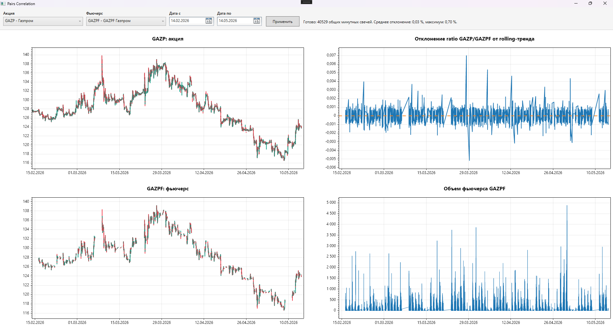

This screenshot shows `PairsCorrelation` for GAZP stock and the related GAZPF futures contract over 14.02.2026 - 14.05.2026. The left charts compare the stock and futures price paths. The upper-right chart shows the deviation of the stock/futures ratio from a rolling trend, and the lower-right chart shows futures volume.

Backtesting interpretation: visible ratio spikes exist, but most deviations are small. Events large enough to cover both legs of broker commission and the bid/ask spread of both instruments are rare. The larger spikes also tend to appear near low-liquidity or uneven-volume areas, where the theoretical arbitrage signal is harder to execute at the displayed prices.

#### Pairs Correlation - SBER / SBERF

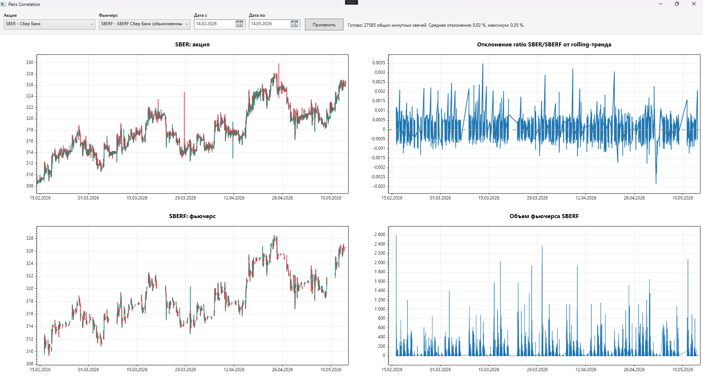

This run applies the same diagnostic view to SBER stock and SBERF futures over 14.02.2026 - 14.05.2026. The average ratio deviation is small, while occasional larger deviations appear as short-lived spikes rather than persistent tradable windows.

Backtesting interpretation: the chart supports the same conclusion as the GAZP case. Market-maker activity and stock/futures microstructure can create temporary inefficiencies, but the economically useful events are sparse. After accounting for double broker commission, two-sided spreads, and execution risk, the remaining opportunities are not frequent enough to form a stable standalone profit source.

#### Pairs Correlation Research Takeaways

- Stock/futures ratio deviations are observable, but most are too small to cover realistic transaction costs.
- A complete trade needs two executions to enter and two executions to exit, so broker commission and spread costs are effectively paid on both instruments.
- The largest deviations often coincide with lower liquidity, uneven futures volume, or short-lived market microstructure noise.
- Low-liquidity moments reduce practical fill quality and make the displayed theoretical edge difficult to capture.
- The practical conclusion is cautious: `PairsCorrelation` is useful for visual diagnostics and market-efficiency research, but these screenshots do not support a stable strategy based only on repeatedly harvesting stock/futures deviations.

#### RoboFutureArbitr - Collected Data Analysis

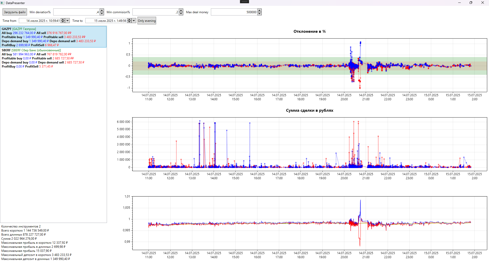

`RoboFutureArbitr` was used to collect stock/futures arbitrage data for several weeks and then analyze it offline. The preliminary analysis found that almost every day at least a few stock/futures pairs showed substantial correlation or ratio deviations that looked large enough, in theory, to create a tradable profit after transaction costs.

The data presenter highlights these moments as deviation spikes and shows the estimated deal size and theoretical profit for long and short directions. At this stage, the research looked promising: the market appeared to produce repeated temporary inefficiencies between the stock and the related futures contract.

#### RoboFutureArbitr - Liquidity Reality Check

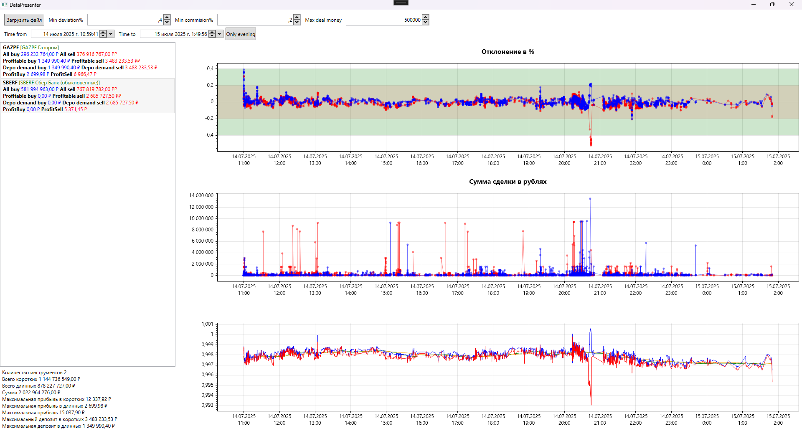

The trading robot and later tick-data review changed the conclusion. The robot confirmed that the strategy was not practically workable and helped identify why. Many of the strongest apparent opportunities were not persistent arbitrage windows. They were often caused by one-off large trades, distorted prints, or ultra-low-liquidity periods before evening clearing. In those moments, even if one leg could be executed, the opposite leg could not reliably be filled at a profitable price because market depth disappeared.

Backtesting interpretation: the signal existed on the chart, but the opportunity was not practically executable. This is the central difference between a theoretical deviation and a tradable arbitrage setup. The strategy needs simultaneous liquidity on both instruments, realistic fill assumptions, and enough time to complete both legs. Without that, the visible deviation is mostly an artifact of market microstructure.

#### RoboFutureArbitr Research Takeaways

- Several weeks of collected data showed frequent theoretical stock/futures deviations.
- Offline analysis alone overestimated the profitability of these events.
- Tick-level inspection and live trading revealed that many deviations came from isolated large trades or very low liquidity.
- Evening clearing periods produced especially misleading signals because one side of the pair could become difficult or impossible to hedge at a favorable price.
- A tradable arbitrage signal must be validated by executable depth, not only by price deviation.
- The trading robot confirmed the strategy failure mechanism in practice, matching the later tick-level explanation.
- The practical conclusion is strict: `RoboFutureArbitr` is useful for studying futures-arbitrage mechanics, but the tested deviations did not form a stable, scalable profit source after liquidity and execution constraints were included.

## Credentials And Secrets

API tokens are not intended to be stored in source files or JSON configuration files. Runtime code reads secret values from Windows Credential Manager by name.

Use `CredentialsEditor` to manage local secrets:

- list credentials by `UserName` filter;
- add a new credential;
- view or edit an existing credential;
- delete a selected credential after confirmation.

Typical credential names used by the applications are configuration values such as `InvestTestAccount`, `ChatGPTApiKey`, and `DeepSeekApiKey`. These are names of local Windows credentials, not the secret values themselves.

Before publishing or pushing changes, check that no real API keys are present in source files, config files, logs, screenshots, or sample data.

## Build

Requirements:

- Windows
- .NET 8 SDK
- Visual Studio 2022 or another IDE capable of building WPF projects

Restore and build:

```powershell
dotnet restore .\Trading.sln
dotnet build .\Trading.sln
```

Some projects depend on local credentials or market-data availability at runtime, but the solution should build without committing secrets.

## Repository Hygiene

Generated build artifacts are intentionally excluded:

- `bin/` libraries and executables;
- `obj/` intermediate MSBuild files;
- Visual Studio local files such as `.vs/` and `*.user`;
- logs and temporary files.

JSON files are not globally ignored because this repository uses JSON for reference and test data. If JSON data is generated under `bin/Debug`, only the relevant data files should be committed. Build-generated JSON files such as `*.deps.json`, `*.runtimeconfig.json`, and `obj/project.assets.json` should generally stay out of the repository.

Longer term, test and sample data should preferably live in explicit folders such as `Data/`, `TestData/`, or `Samples/` rather than under `bin/Debug`.

## Status

This is a portfolio-oriented research repository. The codebase is useful for demonstrating trading-domain engineering, backtesting UI workflows, and integration with external APIs, but it is not presented as a finished commercial trading platform.
